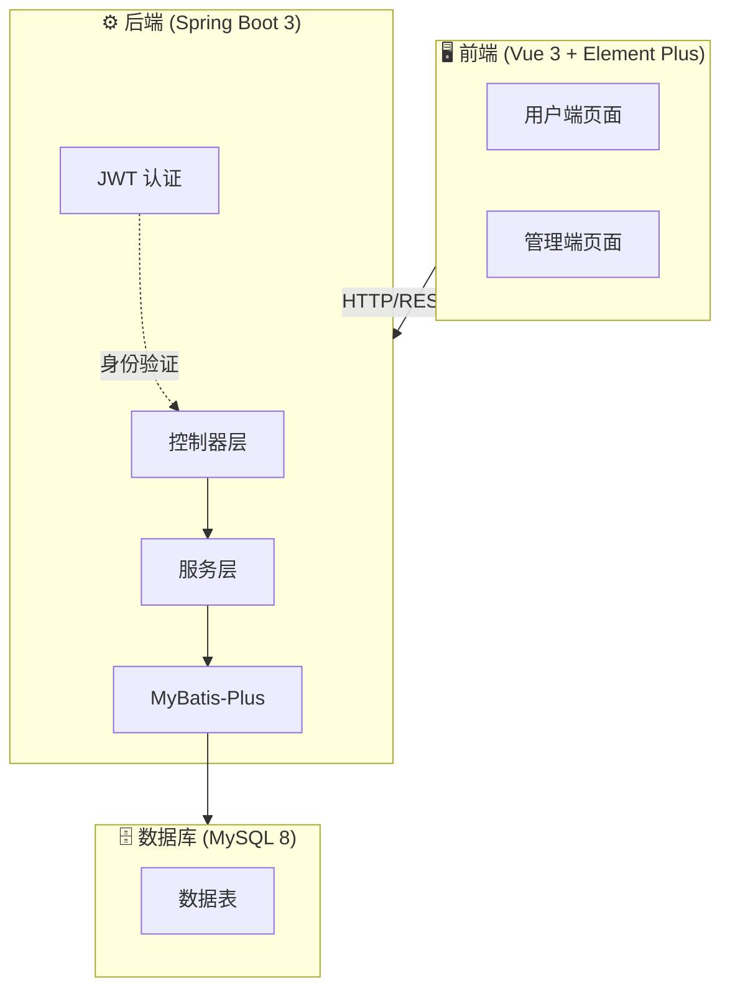
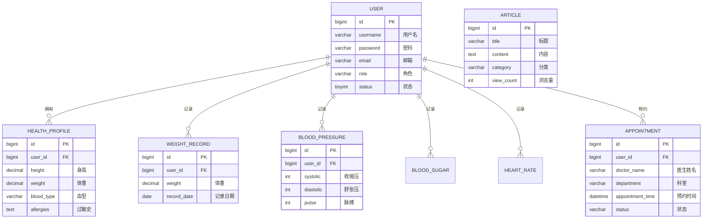

# 🏥 个人健康管理系统

> **一站式个人健康数据管理平台** - 您的健康管家

基于 Spring Boot + Vue.js 构建的全栈个人健康管理系统，帮助用户记录、追踪和分析个人健康数据，包括体重、血压、血糖、心率等关键指标，同时提供健康文章阅读和预约管理功能。

---

## 🏗️ 系统架构



---

## 🛠 技术栈

| 层级 | 技术 |
|------|------|
| **前端** | Vue 3 + Element Plus + Pinia + Vue Router + Axios + ECharts |
| **后端** | Spring Boot 3.2 + MyBatis-Plus + Spring Security + JWT |
| **数据库** | MySQL 8.0 |
| **容器化** | Docker |
| **构建工具** | Maven 3.9 (后端) + Vite 5 (前端) |

---

## 💾 数据库设计



---

## 📁 项目结构

```
repo/
├── README.md                    # 项目文档
├── start.sh                     # 容器启动脚本
├── backend/                     # Spring Boot 后端
│   ├── pom.xml
│   ├── settings.xml            # Maven 阿里云镜像配置
│   └── src/main/
│       ├── java/com/health/
│       │   ├── config/         # 配置类
│       │   ├── controller/     # REST 控制器
│       │   ├── service/        # 业务服务层
│       │   ├── mapper/         # MyBatis Mapper
│       │   ├── entity/         # 实体类
│       │   ├── dto/            # 数据传输对象
│       │   ├── vo/             # 视图对象
│       │   ├── common/         # 通用工具类
│       │   ├── security/       # JWT 安全配置
│       │   └── exception/      # 异常处理
│       └── resources/
│           └── application.yml
├── frontend/                    # Vue.js 前端
│   ├── nginx.conf              # Nginx 配置
│   ├── package.json
│   ├── vite.config.js
│   └── src/
│       ├── api/                # API 请求模块
│       ├── components/         # 公共组件
│       ├── layouts/            # 布局组件
│       ├── router/             # 路由配置
│       ├── stores/             # Pinia 状态管理
│       ├── styles/             # 全局样式
│       ├── utils/              # 工具函数
│       └── views/              # 页面组件
│           ├── user/           # 用户端页面
│           └── admin/          # 管理端页面
└── database/
    └── init.sql                # 数据库初始化脚本
```

---

## 🚀 快速开始 (外层 Dockerfile)

### 前置条件
- 安装并运行 Docker

### 启动步骤

1. 在外层环境目录执行，目录内应包含 `Dockerfile` 和 `repo/`：
   ```bash
   docker build -t health-management .
   ```

2. 启动容器：
   ```bash
   docker run --name health-management -p 80:80 -p 8080:8080 -p 3306:3306 health-management
   ```

3. 等待日志里出现 `Health management system is ready.`

4. 访问应用：
   - 前端应用: http://localhost
   - 后端 API: http://localhost:8080/api
   - 数据库: localhost:3306 (用户名: root / 密码: root)

---

## 🧪 测试账号

| 角色 | 用户名 | 密码 |
|------|--------|------|
| 👑 **管理员** | admin | 123456 |
| 👤 **普通用户** | user | 123456 |
| 👤 **普通用户** | zhangsan | 123456 |
| 👤 **普通用户** | lisi | 123456 |

---

## 📷 功能特性

### 👤 用户端功能

| 功能 | 描述 |
|------|------|
| 🔐 **登录注册** | 用户注册和 JWT 登录认证 |
| 📊 **仪表盘** | 健康数据概览与图表展示 |
| 📋 **健康档案** | 管理个人健康信息 |
| ⚖️ **体重记录** | 记录并可视化体重趋势 |
| 💓 **血压记录** | 追踪收缩压/舒张压数据 |
| 🩸 **血糖记录** | 监测血糖水平 |
| ❤️ **心率记录** | 记录静息/运动心率 |
| 📅 **预约管理** | 预约和管理就诊记录 |
| 📰 **健康资讯** | 浏览健康科普文章 |
| ⚙️ **个人设置** | 更新个人信息和修改密码 |

### 👑 管理端功能

| 功能 | 描述 |
|------|------|
| 📈 **数据统计** | 系统使用数据分析 |
| 👥 **用户管理** | 管理所有用户账户 |
| 📝 **文章管理** | 创建和发布健康文章 |

---

## 🔧 专业工程实践

### 1. 📝 日志系统
- 使用 SLF4J + Logback 结构化日志
- 请求/响应日志便于调试
- 开发和生产环境分离日志级别

### 2. 🛡️ 异常处理
- 全局异常处理器 `@RestControllerAdvice`
- 统一的错误响应格式
- 友好的错误提示信息

### 3. ✅ 数据验证
- 后端: JSR-303 Bean Validation
- 前端: Element Plus 表单验证
- API 输入数据校验

### 4. 🔌 API 设计
- RESTful API 规范
- 统一响应结构
- JWT 认证机制
- 基于角色的访问控制

### 5. 🏭 生产级特性

| 特性 | 状态 |
|------|------|
| 响应式设计 | ✅ |
| 数据持久化 | ✅ |
| 模块化架构 | ✅ |
| Docker 容器化 | ✅ |
| 数据库迁移 | ✅ |
| 错误边界处理 | ✅ |
| 加载状态 | ✅ |
| 表单验证 | ✅ |

---

## 🐳 Docker 配置

### 服务列表

| 服务 | 端口 | 描述 |
|------|------|------|
| MySQL | 3306 | 数据库 |
| Backend | 8080 | Spring Boot API |
| Frontend | 80 | Vue.js 应用 |

---

## 📜 常用命令

```bash
# 构建镜像
docker build -t health-management .

# 启动容器
docker run --name health-management -p 80:80 -p 8080:8080 -p 3306:3306 health-management

# 查看日志
docker logs -f health-management

# 停止容器
docker stop health-management
```

---

## 📄 开源协议

本项目采用 MIT 协议开源。

---

## 🙏 致谢

- [Spring Boot](https://spring.io/projects/spring-boot)
- [Vue.js](https://vuejs.org/)
- [Element Plus](https://element-plus.org/)
- [MyBatis-Plus](https://baomidou.com/)
- [ECharts](https://echarts.apache.org/)
